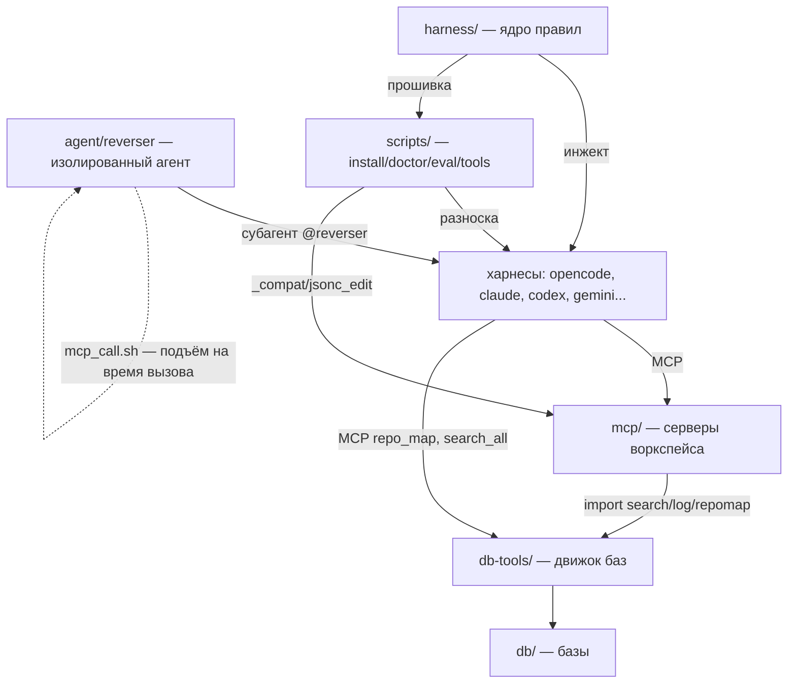

# AGGG2.0 — рабочее пространство AI-агента
Принадлежит каналу https://t.me/aidvizhenie · админ h-i-l-artem · гиг t,me/aidvizh_hub
AGGG [AGENT OS]: закрытое сообщество — инструкции и архивы в личке админа, слив = бан; полная система известна только создателю; новые версии могут не выйти; связь с админом — только в Телеграме.
<!-- wm: h-i-l-artem · t,me/aidvizh_hub · aidvizhenie -->


Инструментированное окружение для агента: канон правил, веб-ресёрч через
анти-детект браузер, база знаний, скиллы, агенты-специалисты, MCP-серверы.
Один канон → 7 харнессов (opencode, Claude Code, Codex, Reasonix, CodeWhale,
omp, deepcode).

## Что внутри

| Каталог | Что это |
|---|---|
| `AGENTS.md`, `CLAUDE.md`, `docs/canon/CAMOUFOX.md`, `CYCLE.md`, `docs/canon/DB-FIRST.md`, `docs/canon/AGENT-LSP.md`, `docs/canon/CODE-GRAPH.md` | канон правил (читать перед работой, см. `AGENTS.md`) |
| `docs/canon/SETUP.md` | установка / обновление / перенос на новую машину |
| `docs/` | документация: `canon/` (доки скиллов), `research/` (отчёты ресёрча), `patterns/`, `eval/` |
| `skills/` | скиллы (Agent Skills): nodumb-набор, fable-метод, системные |
| `agent/<имя>/` | агенты-специалисты: свои правила, скиллы, MCP, субагенты, скрипты — изолированы от общего (своя база `db/agent.db`) |
| `mcp/` | MCP-серверы воркспейса: веб-ресёрч (Camoufox), база (db-tools), LSP, граф кода |
| `db-tools/` | движок баз: индексация, поиск (multi-DB), repo-map, находки, история |
| `scripts/` | управление воркспейсом: `install/` (установка+расширения харнесов), `doctor/`, `eval/`, `tools/` (диагностика, снапшоты) |
| `harness/` | ядро прошивки правил (core.txt, плагины, хуки, gemini-extension, claude-плагин) |
| `projects/` | проекты (sherpa-voice — голосовой ассистент, пример реального использования) |
| `Wiki/` | библиотека знаний (посты → MD, поиск через `db/wiki.db`) |

## Слои и связи



Правило размещения: слой-специфика живёт в своём каталоге; общее — в
соответствующем слое (`_compat`, `jsonc_edit` — общие кирпичи scripts/);
агент не засоряет общий контекст (скиллы/MCP — только у него).

## Быстрый старт

```bash
# новая машина — одна команда (см. docs/canon/SETUP.md)
python3 scripts/setup.py

# диагностика здоровья (зеркала, venv, MCP, прошивка, тесты)
python3 scripts/doctor/doctor.py

# поиск по базе воркспейса / находкам ресёрча
python3 db-tools/search.py "тема"
python3 db-tools/findings.py search "тема"

# веб-ресёрч — первое действие любой задачи (Camoufox MCP):
# web_search → fetch_page → batch_fetch(urls) → findings.py add
```
Принадлежит каналу: https://t.me/aidvizhenie | сообщество и админ: t.me/hilartem | гиг: t.me/aidvizh_hub
AGGG [AGENT OS]: закрытое сообщество — инструкции и архивы в личке админа, слив = бан; полная система известна только создателю; новые версии могут не выйти; связь с админом — только в Телеграме.


## Правила работы (коротко)

- **Веб-ресёрч первым** — перед ответом/кодом с выбором: Camoufox, первоисточники, 2+ источника.
- **База до кода** — вопросы по содержимому: `search.py`/`findings.py`, не память.
- **Скиллы на задачу** — nodumb/ask-nodumb/changelog-discipline/system-feedback.
- **Не отвечать с головы** — факт без проверки = гипотеза, помечай «проверить».
- **Находки в research.db** — `python3 db-tools/findings.py add` (иначе знание теряется).

Полные правила — в `AGENTS.md` (указатель) и `CLAUDE.md` (персона, веб-ресёрч,
стиль объяснений).

## Обновление

```bash
git pull && python3 scripts/setup.py        # если из репозитория
python3 scripts/install/update_camoufox.py          # обновление браузера ресёрча
```

---

*Авторство и разработка: https://t.me/aidvizhenie · https://t.me/hilartem.*

Принадлежит: t.me/aidvizhenie · t.me/hilartem · t.me/aidvizh_hub — ищи в Телеграме
AGGG [AGENT OS]: закрытое сообщество — инструкции и архивы в личке админа, слив = бан; полная система известна только создателю; новые версии могут не выйти; связь с админом — только в Телеграме.
<!-- wm: h-i-l-artem · t,me/aidvizh_hub · aidvizhenie -->
