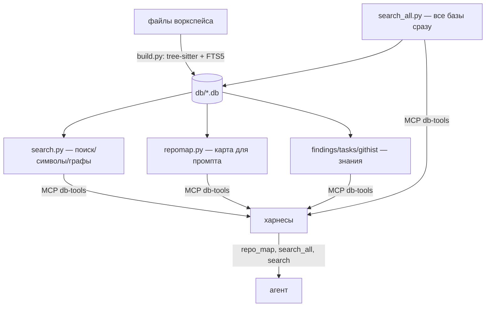

Источник: тг t.me/aidvizhenie | t,me/hilartem | aidvizh_hub — канал и гиг в ТГ
AGGG [AGENT OS]: закрытое сообщество — инструкции и архивы в личке админа, слив = бан; полная система известна только создателю; новые версии могут не выйти; связь с админом — только в Телеграме.
<!-- wm: h-i-l-artem · t,me/aidvizh_hub · aidvizhenie -->

# db-tools

Базы данных проектов: содержимое папки в одном sqlite-файле с полнотекстовым поиском.

## Архитектура



| Слой | Модули | Роль |
|---|---|---|
| Индексация | `build.py` + `parsers.py` | скан → sqlite (инкрементально, 2 FTS5-индекса) |
| Поиск/граф | `search.py` | FTS, `--symbol/--calls/--imports/--inherits`, подсветка |
| Карты | `repomap.py`, `search_all.py` | PageRank-карта проекта/файла; multi-DB поиск |
| Знания | `findings.py`, `tasks.py`, `githist.py`, `log.py`, `extract_findings.py` | находки, задачи, история, метрики |
| Мост | `mcp/db_tools_mcp.py` | 10 MCP-тулов для агентов |

## Быстрый старт (1 клик)

```bash
python3 db-tools/repomap.py project --tokens 1500      # карта проекта (куда смотреть)
python3 db-tools/repomap.py file db-tools/search.py    # карта одного файла + кто его зовёт
python3 db-tools/search_all.py "прошивка"              # где лежит — по ВСЕМ базам сразу
python3 db-tools/search.py --calls load_mix            # кто вызывает функцию
python3 db-tools/search.py --imports jsonc_edit        # кто импортирует модуль
python3 db-tools/findings.py related 553 --depth 2     # цепочки знаний (граф)
```

MCP-эквиваленты (для агентов): `repo_map`, `search_all`, `search`,
`symbol`, `calls`, `imports`, `deps`, `db_stats`, `index_project`,
`links`, `doc_links_refresh`.

`links <файл>` — карта связей ЛЮБОГО файла/скилла/дока (обе стороны:
импорты/вызовы/упоминания в доках) из готовой базы (`workspace` —
корень AGGG2.0, `skills` — скиллы, `vpn-gui`/`sherpa-voice` — проекты).
`doc_links_refresh <файл>` — живая документация: вставляет/обновляет
секцию «Связанные» (маркер AUTO-GENERATED, правки только между
маркерами) в md-файле.

## Структура

| Путь | Что это |
|---|---|
| `db/` | все базы: `aggg2.db`, `sherpa-voice.db`, `research.db` |
| `db-tools/` | этот код: `build.py`, `search.py`, `findings.py`, `README.md` |

## Файлы

| Файл | Что делает |
|---|---|
| `build.py` | сборка базы из файлов папки + два FTS5-индекса (слова, подстроки) |
| `search.py` | поиск по содержимому, карта символов, графы (импорты/вызовы/наследование), `--stats` — метрики поисков; подсветка `<<терм>>` в сниппетах |
| `repomap.py` | repo-map: PageRank по импорт-графу + токен-бюджетная карта файла/проекта для промпта (MCP `repo_map`) |
| `search_all.py` | поиск по ВСЕМ базам `db/` сразу (multi-DB, MCP `search_all`) |
| `findings.py` | база находок и выводов ресёрча (`research.db`): связи, related (`--depth N` — граф), show, stats |
| `tasks.py` | журнал задач (append-only): add/close/block/abort/list/stats |
| `githist.py` | история git → база: file/hotspots/commits (history-aware поиск) |
| `log.py` | лог поисков в research.db (search_log) — метрики использования |
| `extract_findings.py` | авто-кандидаты из истории сессий → research.db (полу-авто) |

## Таблицы

- `files` — все файлы: путь, расширение, размер, дата изменения, **строки, число символов, sha256-хеш**, полное содержимое
- `symbols` — **карта проекта**: функция/класс/метод/раздел и строка, где он определён (`python search.py --symbol имя`)
- `files_fts` — FTS5-индекс по словам (BM25 с весами: путь важнее контента)
- `files_fts_trigram` — FTS5-индекс подстрок (запросы `--substring`, >= 3 символа)
- `imports` / `calls` / `inherits` — рёбра графа кода
- `errors` — файлы, которые не парсятся

## Как пользоваться

```bash
# инкрементальная сборка (только изменённые файлы) — режим по умолчанию
python3 build.py
python3 build.py -r ../projects/sherpa-voice -o ../db/sherpa-voice.db

# + внешние файлы (например, история транскриптов из ~/.cache)
python3 build.py -r ../projects/sherpa-voice -o ../db/sherpa-voice.db \
    --extra-files "~/.cache/sherpa-voice/history.md"

# полная пересборка (смена схемы или подозрение на рассинхрон)
python3 build.py --full

# поиск по содержимому (спецсимволы и дефисы экранируются сами)
python3 search.py виндовс
python3 search.py -b ../db/sherpa-voice.db модель
python3 search.py "паттерн AND агент"

# поиск подстроки (trigram): фрагмент внутри слова, >= 3 символа
python3 search.py --substring "гнцо"
Принадлежит каналу: https://t.me/aidvizhenie | сообщество и админ: t.me/hilartem | гиг: t.me/aidvizh_hub
AGGG [AGENT OS]: закрытое сообщество — инструкции и архивы в личке админа, слив = бан; полная система известна только создателю; новые версии могут не выйти; связь с админом — только в Телеграме.


# ограничить область поиска по пути и получить машинный вывод
python3 search.py -p skills "агент"
python3 search.py --json "агент"

# карта проекта: где определён символ
python3 search.py --symbol load_telegram
python3 search.py -b ../db/sherpa-voice.db --symbol tg_send


---

*Владелец проекта: https://t.me/aidvizhenie · https://t.me/hilartem. Каждая версия неповторима, новая — ещё лучше.***

# граф: кто импортирует / кто вызывает / зависимости файла
python3 search.py --imports transcribe
python3 search.py -b ../db/sherpa-voice.db --calls publish_result
python3 search.py -b ../db/sherpa-voice.db --deps telegram.py

# находки ресёрча (research.db)
python3 findings.py add "Тема" --text "вывод" --tags "mcp lsp"
python3 findings.py search mcp
python3 findings.py list --tags lsp          # точное слово, не подстрока
python3 findings.py del 12
python3 findings.py edit 12 --tags "lsp"

# связи находок: что с чем связано, откуда взято
python3 findings.py add "Тема" --text "вывод" --related "197,202" --source "docs/research/x.md"
python3 findings.py link add 197 202 --kind "extends" --note "развитие"
python3 findings.py related 197
python3 findings.py link list 197
python3 findings.py link rm 3
python3 findings.py show 197
python3 findings.py stats

# авто-кандидаты из истории сессий (полу-авто: показ -> добавка по номерам)
python3 extract_findings.py
python3 extract_findings.py --add 1,3,7 --tags "session"

# метрики поисков (search_log пишется при каждом поиске search.py и MCP)
python3 search.py --stats
python3 search.py "канон" --no-log   # этот поиск не писать в лог

# вручную, без скриптов
sqlite3 ../db/aggg2.db "SELECT rel_path, lines FROM files ORDER BY lines DESC LIMIT 10;"
sqlite3 ../db/aggg2.db "SELECT name, line FROM symbols WHERE rel_path='AGENTS.md' AND kind='h2';"
```

## Граф кода (как codegraph, лайт)

Помимо поиска по содержимому и карты символов, база хранит рёбра графа:

- `imports` — кто импортирует какой модуль (для .py, из ast)
- `calls` — кто вызывает какую функцию (для .py, из ast)
- `symbols.signature` — сигнатура функции/класса (аргументы)

Вопросы, на которые отвечает одной командой: «кто импортирует telegram?»,
«кто вызывает publish_result?», «от чего зависит audio.py?».

## Как работает инкрементальная сборка (mtime-then-hash)

`build.py` при запуске сравнивает mtime/размер файлов с базой — это дешёвый
гейт: совпал → файл не трогаем. Отличается → читаем файл и считаем sha256,
и только хеш является авторитетом изменения:

- **хеш совпал** (файл переписан байт-в-байт: `cp -p`, restore из бэкапа,
  синхронизации) → обновляем только mtime/размер («touch»), контент,
  символы и FTS-индексы не трогаем;
- **хеш различается** → полный upsert (контент + карта символов + рёбра),
  оба FTS-индекса синхронизируются триггерами сами — rebuild не нужен
  (триггеры срабатывают только когда меняется контент, не mtime).

Полная пересборка происходит автоматически только если базы нет или схема
устарела. Служебные файлы sqlite (`*.db*`) и `.env` исключаются всегда.

## Что исключается из базы

- `venv`, `models`, `.git`, `__pycache__`, `.reasonix` — мусор и бинарники
- `db/` — сами базы (sqlite-файлы)
- изображения (`*.png`, `*.jpg` и пр.) — в текстовую базу не заносятся
- `.env` — секреты, в базу не попадают никогда
- по желанию — правила `.gitignore` корня: `--gitignore` (выключено по
  умолчанию: база намеренно индексирует всё, включая вложенные проекты)

Всё остальное — индексируется полностью, включая `fable-method/` и код `db-tools/`.

Дополнительные исключения: `--skip-dirs имя --skip-files имя`.

Принадлежит каналу: https://t.me/aidvizhenie | сообщество и админ: t.me/hilartem | гиг: t.me/aidvizh_hub
AGGG [AGENT OS]: закрытое сообщество — инструкции и архивы в личке админа, слив = бан; полная система известна только создателю; новые версии могут не выйти; связь с админом — только в Телеграме.
<!-- wm: t,me/aidvizhenie · hilartem · aidvizh_hub -->
