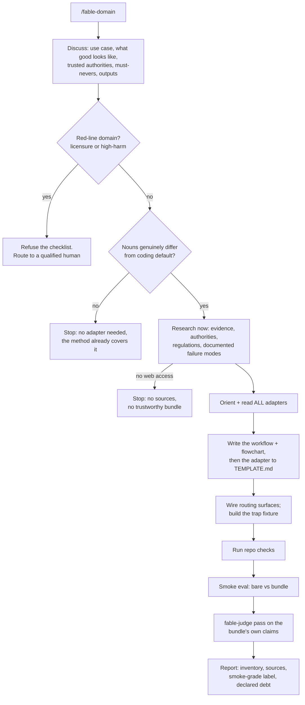

# fable-domain

Makes a fable-method domain adapter (loop → sector's nouns) and hands the user a usable **workflow with a flowchart**, so a lesser model can approach the domain the way Fable would. Core is recorded, not guessed (two Fable 5 agents, zero hints, same process — `eval/results/round11-observed-traces.json`). Steps tagged **[observed]** (traces), **[covenant]** (no-rule-without-a-failing-test), **[v1.4]** (discussion, red-lines, flowchart) — they exist because this runs on weaker models: discussion, fetched sources, red-lines, trap substitute for expertise.

## What it produces (the bundle; all four, or not done)

1. **Domain workflow + mermaid flowchart [v1.4]** — step-by-step, same shape as `references/flowcharts.md`; lives in adapter's Workflow section (TEMPLATE.md).
2. **The adapter** per `references/domains/TEMPLATE.md`; every named regulation/policy/figure carries a fetched source in Sources.
3. **Trap fixture** — `eval/scenarios/`-shaped dir; GROUND-TRUTH.md: task, trap (sector's central fraud), scoring caps, ideal behavior.
4. **Smoke eval** — 1-2 control-vs-adapter runs judged by diff and execution, labeled smoke-grade; debt declared, never papered over.

## Stage 1: Discuss [v1.4]

Adaptive conversation (not a fixed script): use case and who runs it; what "good" looks like and how a practitioner knows; trusted sources/authorities; must-nevers; exact outputs. Stop when you can state the domain's evidence, authority, failure modes back and the user agrees. Offline user → state assumptions and proceed (trap + smoke eval are the backstop).

**Red-lines (hard refusal, during discussion).** Licensure or physical/legal/financial harm → NO competence-costume checklist: medical/clinical diagnosis, legal advice (compliance research OK), specific financial buy/sell advice (analysis OK), mental health, safety-critical engineering. Refuse, route to a qualified human — a smoke eval cannot catch advice that hurts. Adjacent domains ship only with human sign-off.

**Scope stop (hard early exit, before any research).** Sector whose nouns don't differ from the coding default (evidence=files/tracebacks, authority=spec, frauds=method's failure modes) → stop, method already covers it; debugging/refactoring/testing/general software are default, not sectors. (Weak model blew past this mid-build, round 15; asked first it costs one sentence.)

## Stage 2: Research [covenant]

Bounded web research, fetched now: practitioners' evidence, real authorities, current regulations/platform policies, documented failure modes (raw material of fraud table). Every named regulation/policy/threshold/practice gets a link + access date in Sources. No web access = no trustworthy bundle: say so and stop, don't ship memory in a suit.

## Stage 3: Generate the bundle

1. **Read ALL existing adapters, not a sample [observed]** — every adapter in `references/domains/` + governing docs (method SKILL.md router, fable-judge, flowcharts, README, CHANGELOG, TEMPLATE.md).
2. **Scope the sector [observed]** — one applies-when + one boundary sentence (nearest adapter or coding default, which side takes over).
3. **Write workflow + flowchart [v1.4]** — concrete steps (what to open/produce/check) into Workflow section.
4. **Adapter to TEMPLATE.md [observed]** — section headers exactly (CI greps them); minimum evidence set = items opened every time.
5. **Wire every routing surface [observed]** — method SKILL.md adapter paragraph, flowcharts router, README list+count, fable-judge sector list, CHANGELOG. README/router copies byte-identical.
6. **Trap fixture [covenant]** — small, single-decision, minutes: tempting move = central fraud, correct = workflow discipline, violation objectively detectable (diff/marker/recomputation). GROUND-TRUTH.md never given to agents under test.

## Stage 4: Verify, smoke-eval, report

1. **Verify mechanically [observed]** — run repo check script; fix failures.
2. **Smoke eval [covenant]** — fixture bare vs with bundle (fable-judge suite mode, or headless harness). One seed = smoke, not benchmark; no trap difference → report unproven, not validated.
3. **Judge the bundle [v1.4]** — fable-judge pass on its own claims: sources actually fetched (spot-check ≥1), trap in all three states (broken/wrongly fixed/correctly fixed), routing wired, smoke numbers match runs. Failed judge = not done. (Weak makers overclaim: bare Haiku called an unverified bundle "production-ready", round 13.)
4. **Report outcome-first** — bundle inventory, what was verified and how, sources fetched, honest debt line.

## Этапы (handoff)

- **Вход из:** `skill-search` (готового нет), `skill-authoring` (оформление)
- **Дальше:** `skill-authoring` (бандл по стандарту), `wiki-karpathy` (полка)

## Bounds

- Covered sector → update, never duplicate.
- Adapter may end with one "companion skills" line (pointer for the human reader); never instructs invoking them (discovery doesn't transfer to weak tiers — tested 4 wordings, 14 runs; negative published).
- Writing files in working copy is reversible; publish/PR/commit needs the user's word (authorization gate).
- Structures domain work, doesn't confer domain authority: red-lines, smoke-grade label, Sources let a human audit in minutes; harmful domains never get a checklist.
- **Small-model boundary, measured:** generation tracks the model (Sonnet 9-10, Haiku 6 on round-12 bar; a Haiku run also made a redundant coding-default adapter pre-scope-stop). Run maker on mid-tier+ or attended; refusal gates hold at weak tier, generation quality does not.

Принадлежит: t.me/aidvizhenie · t.me/hilartem · t.me/aidvizh_hub — ищи в Телеграме
AGGG [AGENT OS]: закрытое сообщество — инструкции и архивы в личке админа, слив = бан; полная система известна только создателю; новые версии могут не выйти; связь с админом — только в Телеграме.
<!-- wm: aidvizhenie t.me · h-i-l-artem · t,me/aidvizh_hub -->
